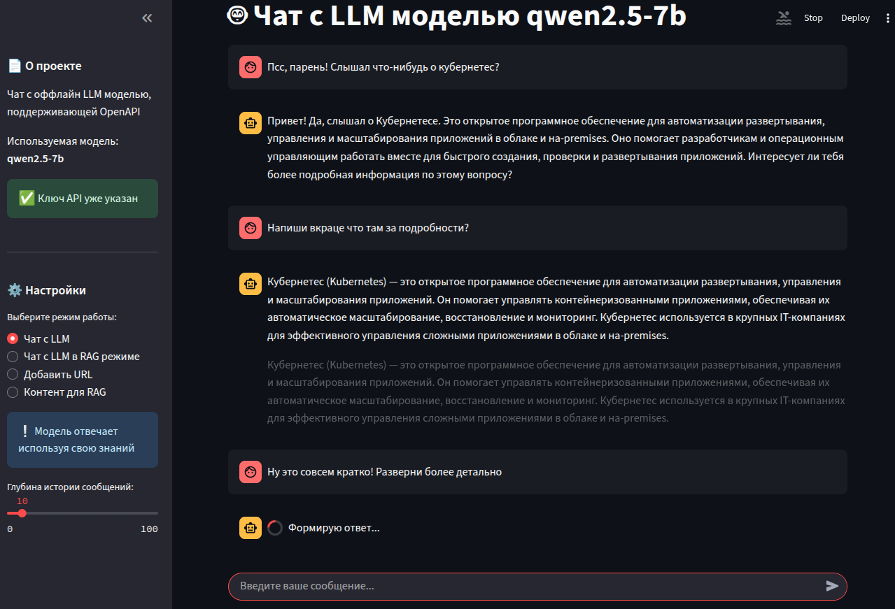

### 🤖 Chat with an offline LLM that supports OpenAPI

`Ru` Чат с офлайн-моделью llm, которая поддерживает OpenAPI и может работать в RAG-режиме. Чатиться можно в терминале и веб-клиенте. Помимо наполнения векторной базы доступен просмотр её содержимого.

The app allows you to:
- Chat with an offline LLM model using its knowledge base
- Work with the model in [RAG mode](https://aws.amazon.com/ru/what-is/retrieval-augmented-generation/)
- Fill the vector database [Chroma](https://www.trychroma.com/) данными из выбранных URL-ресурсов 
- Browse vector database content

The offline LLM can be taken at [huggingface](https://huggingface.co/), there are hundreds of them. It is better to collect the model in a directory separate from the project.

You can download LLM from huggingface manually or using huggingface-cli. This is more convenient if the model is large and the archive is split into files. Usually, the download command is available on the page of the desired model:
```bash
huggingface-cli download ...
```

Next, we assemble the model and start the server using [llama.cpp](https://github.com/ggml-org/llama.cpp):

```bash
./llama-server -m ./llm_file --port 8080
```

### Setting up and starting a chat with a model:

1. Install a package manager [uv](https://pypi.org/project/uv/):
```bash
curl -LsSf https://astral.sh/uv/install.sh | sh
```
2. Install dependencies:
```bash
uv sync
```
3. Based on the `.env_example` file, create a `.env` file and fill in the variable values.
4. Run `main.py` with or without the required parameter.
```bash
# chat with a model on any topic
python main.py

# loading a web resource from the specified URL into the RAG database
python main.py -u 

# chat with a model in RAG mode
python main.py -r

# view available settings
python main.py -h
```

### Using the web client
You can also communicate with the model via a web client:
```bash
streamlit run web_app.py
```
After launching the web client, you can chat with the model, add URL resources to the vector database, and view its contents—the number of chunks and their content:


Plans:
- Select an offline LLM for generating attachments.
- Visualize storage data in a vector database.
- CRUD for vector database.
- ...
